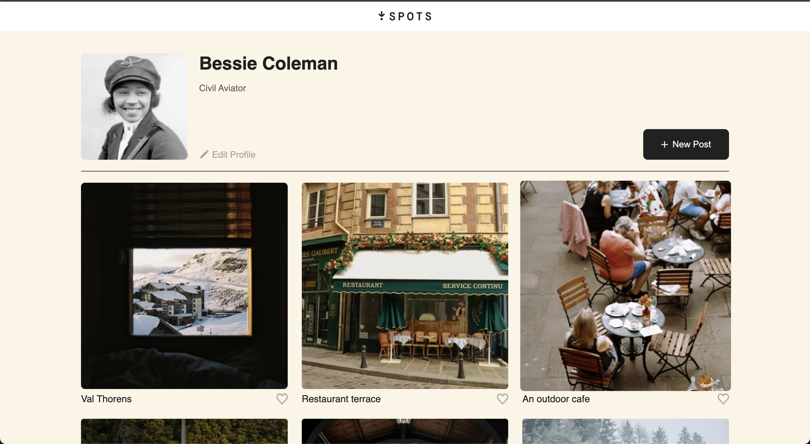

<!-- # Spots Gallery

A simple React photo gallery built with Vite, where users can create a profile, upload new posts (images with captions), and “like” posts by tapping the heart icon. All data (profile, posts, and likes) persists in `localStorage`, so it survives page refreshes.

---

## Table of Contents

1. [Project Overview](#project-overview)  
2. [Features](#features)  
3. [Getting Started](#getting-started)  
   - [Prerequisites](#prerequisites)  
   - [Installation](#installation)  
   - [Running Locally](#running-locally)  
4. [Folder Structure](#folder-structure)  
5. [Component Breakdown](#component-breakdown)  
   - [`App.jsx`](#appjsx)  
   - [`ProfileHeader.jsx`](#profileheaderjsx)  
   - [`EditProfileModal.jsx`](#editprofilemodaljsx)  
   - [`NewPost.jsx`](#newpostjsx)  
   - [`Gallery.jsx`](#galleryjsx)  
   - [`GalleryCards.jsx`](#gallerycardsjsx)  
6. [Usage](#usage)  
   - [Editing Your Profile](#editing-your-profile)  
   - [Creating a New Post](#creating-a-new-post)  
   - [Liking a Post](#liking-a-post)  
7. [Styling](#styling)  
8. [Contributing](#contributing)  
9. [License](#license)  

---

## Project Overview



Spots Gallery is a lightweight React application scaffolded with Vite. It demonstrates how to:

- Manage multiple pieces of state (profile, posts, likes).  
- Read/write JSON data in `localStorage` for persistence.  
- Show/hide modals in React (Edit Profile & New Post).  
- Build a gallery of images with like buttons and a preview lightbox.  

Everything is built with plain React (no Redux or external state library) and Vite handles HMR, development server, and bundling.

---

## Features

- **User Profile**  
  - Set/update your name, field (e.g., “Frontend Engineering”), and avatar image.  
  - Profile data is saved in `localStorage` under the key `"profile"`.  

- **New Post Upload**  
  - Open a modal, select an image from your device, give it a caption, and save.  
  - Posts appear at the top of the gallery.  
  - All posts are stored in `localStorage` under `"spotsAppLS"`.  

- **Like/Heart Button**  
  - Tap the heart icon on any photo to toggle a “like.”  
  - Liked post captions are tracked in `localStorage` under `"likedHearts"`.  
  - Hearts remain highlighted across page refreshes.  

- **Image Preview Modal**  
  - Click any gallery card to open a lightbox-style preview with a larger view.  
  - Close the preview by clicking the “X” or outside the image area.  

---

## Getting Started

### Prerequisites

- [Node.js ≥ 16](https://nodejs.org/)  
- [npm](https://www.npmjs.com/) or [yarn](https://yarnpkg.com/)  

### Installation

1. **Clone the repository**  
   ```bash
   git clone https://github.com/your-username/spots-gallery.git
   cd spots-gallery
   ```

2. **Install dependencies**
    Using npm:

    ```bash
    npm install
    ```

    Or using yarn:

    ```bash
    yarn
    ```

### Running Locally
Start the Vite development server:

```bash
npm run dev
```

or

```bash
yarn dev
```

By default, the app opens at `http://localhost:5173`. Any changes you save in src/ will hot-reload instantly.

**To build a production bundle:**
```bash
npm run build
```

or

```bash
yarn build
```
 -->

# Spots Gallery

A simple React photo gallery built with Vite, where users can create a profile, upload new posts (images with captions), and “like” posts by tapping the heart icon. All data (profile, posts, and likes) persists in `localStorage`, so it survives page refreshes.

---

## Table of Contents

1. [Project Overview](#project-overview)  
2. [Features](#features)  
3. [Getting Started](#getting-started)  
   - [Prerequisites](#prerequisites)  
   - [Installation](#installation)  
   - [Running Locally](#running-locally)  
4. [Folder Structure](#folder-structure)  
5. [Component Breakdown](#component-breakdown)  
   - [`App.jsx`](#appjsx)  
   - [`ProfileHeader.jsx`](#profileheaderjsx)  
   - [`EditProfileModal.jsx`](#editprofilemodaljsx)  
   - [`NewPost.jsx`](#newpostjsx)  
   - [`Gallery.jsx`](#galleryjsx)  
   - [`GalleryCards.jsx`](#gallerycardsjsx)  
6. [Usage](#usage)  
   - [Editing Your Profile](#editing-your-profile)  
   - [Creating a New Post](#creating-a-new-post)  
   - [Liking a Post](#liking-a-post)  
7. [Styling](#styling)  
8. [Contributing](#contributing)  
9. [License](#license)  

---

## Project Overview

Spots Gallery is a lightweight React application scaffolded with Vite. It demonstrates how to:

- Manage multiple pieces of state (profile, posts, likes).  
- Read/write JSON data in `localStorage` for persistence.  
- Show/hide modals in React (Edit Profile & New Post).  
- Build a gallery of images with like buttons and a preview lightbox.  

Everything is built with plain React (no Redux or external state library) and Vite handles HMR, development server, and bundling.

---

## Features

- **User Profile**  
  - Set/update your name, field (e.g., “Frontend Engineering”), and avatar image.  
  - Profile data is saved in `localStorage` under the key `"profile"`.  

- **New Post Upload**  
  - Open a modal, select an image from your device, give it a caption, and save.  
  - Posts appear at the top of the gallery.  
  - All posts are stored in `localStorage` under `"spotsAppLS"`.  

- **Like/Heart Button**  
  - Tap the heart icon on any photo to toggle a “like.”  
  - Liked post captions are tracked in `localStorage` under `"likedHearts"`.  
  - Hearts remain highlighted across page refreshes.  

- **Image Preview Modal**  
  - Click any gallery card to open a lightbox-style preview with a larger view.  
  - Close the preview by clicking the “X” or outside the image area.  

---

## Getting Started

### Prerequisites

- [Node.js ≥ 16](https://nodejs.org/)  
- [npm](https://www.npmjs.com/) or [yarn](https://yarnpkg.com/)  

### Installation

1. **Clone the repository**  
   ```bash
   git clone https://github.com/your-username/spots-gallery.git
   cd spots-gallery
   ```

2. **Install dependencies**
   Using npm:

   ```bash
   npm install
   ```

   Or using yarn:

   ```bash
   yarn
   ```

### Running Locally

Start the Vite development server:

```bash
npm run dev
```

*or*

```bash
yarn dev
```

By default, the app opens at `http://localhost:5173`. Any changes you save in `src/` will hot-reload instantly.

To build a production bundle:

```bash
npm run build
```

*or*

```bash
yarn build
```

---

## Component Breakdown

Below is a quick overview of each key component and what it does:

### `App.jsx`

* **Purpose**:

  * Manages three top‐level pieces of state:

    1. **`profile`**: an object `{ name, field, avatar }` stored under `"profile"`.
    2. **`posts`**: an array of `{ src, caption }` objects stored under `"spotsAppLS"`.
    3. **Modal flags**: `isEditOpen` (for profile) and `isNewPostOpen` (for posts).

* **Responsibilities**:

  1. **Initialize state** from `localStorage` (lazy `useState` initializer).
  2. **Persist** any change to `profile` / `posts` back into `localStorage` via `useEffect`.
  3. Render:

     * `<ProfileHeader />`
     * `<Gallery posts={posts} />`
     * `<EditProfileModal />` (when `isEditOpen = true`)
     * `<NewPost />` (when `isNewPostOpen = true`)

### `ProfileHeader.jsx`

* **Props**:

  * `userName` (string)
  * `userField` (string)
  * `userAvatar` (URL or `data:` string)
  * `onEditProfile` (callback)
  * `onNewPost` (callback)

* **UI**:

  * Displays the avatar image, the name, and the field below.
  * Renders two buttons/icons:

    * **Edit Profile** (clicking opens the profile modal).
    * **New Post** (clicking opens the new‐post modal).

### `EditProfileModal.jsx`

* **Props**:

  * `isOpen` (boolean)
  * `onClose` (callback)
  * `currentProfile` (object `{ name, field, avatar }`)
  * `onUpdateProfile` (callback receiving updated object)

* **Functionality**:

  * When `isOpen` is `true`, it renders a modal with:

    * An `<input type="file">` for choosing an avatar (reads file as data URL).
    * A `<input type="text">` for name.
    * A `<textarea>` for field.
  * Validates that all fields are non‐empty before enabling the Save button.
  * On Save: calls `onUpdateProfile(updatedProfile)`, which updates `profile` in App and writes to `localStorage`.
  * On Close (or pressing “Escape”), it simply hides the modal without saving.

### `NewPost.jsx`

* **Props**:

  * `isOpen` (boolean)
  * `onClose` (callback)
  * `onSave` (callback receiving `{ src, caption }`)

* **Functionality**:

  * When `isOpen` is `true`, it displays a modal with:

    * `<input type="file">` for selecting an image (reads file as data URL).
    * `<input type="text">` for caption (minimum length = 2).
  * Validates both fields before enabling “Save.”
  * On Save:

    * Packages `{ src: dataUrl, caption }` and calls `onSave()`.
    * The parent (`App.jsx`) will prepend it to `posts` state.
    * That change auto‐persists in `localStorage`.
  * On Close (or pressing “Escape”), hides the modal without saving.

### `Gallery.jsx`

* **Props**:

  * `posts` (array of `{ src, caption }`)

* **State**:

  * `allImages` (combines `posts` + any built‐in starter images).
  * `likedHearts` (array of `caption` strings that user has liked).
  * `previewItem` (the single `{ src, caption }` object to preview).
  * `isPreviewOpen` (boolean for lightbox modal).

* **Responsibilities**:

  1. **Initialize** `likedHearts` from `localStorage` key `"likedHearts"`.
  2. **Persist** any change to `likedHearts` back to `localStorage`.
  3. Whenever `posts` changes, update `allImages = [ ...posts, ...staticImages ]`.
  4. Render a grid of `<GalleryCards />`, passing down:

     * `src`, `caption`,
     * A boolean `isLiked = likedHearts.includes(caption)`,
     * `toggleLike(caption)` callback.
  5. If `isPreviewOpen`, render a lightbox showing `previewItem.src` and `previewItem.caption`.

     * Clicking outside or “X” closes it.

### `GalleryCards.jsx`

* **Props**:

  * `src` (image URL or data URL)
  * `caption` (string)
  * `isLiked` (boolean)
  * `onToggleLike(caption)` (callback)
  * `onOpenPreview({ src, caption })` (callback)

* **UI**:

  * Renders a single card with:

    * An `` thumbnail.
    * A `<span>` or `<p>` to show `caption`.
    * A heart icon/button that is filled if `isLiked === true`, outlined if `false`.
  * Clicking the heart calls `onToggleLike(caption)`.
  * Clicking the image (or a “zoom” icon) calls `onOpenPreview({ src, caption })`.

---

## Usage

Once the app is running at `http://localhost:5173`:

1. **Edit Your Profile**

   * Click the pencil icon (✏️) in the top‐left.
   * Choose an image file, enter your name, and enter your field.
   * Once all fields are non‐empty, the “Save” button enables.
   * After saving, your profile photo, name, and field show up in the header.
   * Refresh the page and your profile data remains saved.

2. **Create a New Post**

   * Click “New Post” (+) next to the edit icon.
   * Select an image file (JPG/PNG), enter a caption (min 3 characters).
   * Click “Save.” The photo appears at the top of the gallery.
   * Posts are immediately visible (no page refresh needed).
   * Refreshing the page still shows your posts.

3. **Like / Unlike a Post**

   * In the gallery, each card has a heart icon.
   * Click the heart to toggle “like.” Liked hearts turn red (or filled).
   * Liked captions are stored in `localStorage` so they remain on refresh.

4. **Preview an Image**

   * Click on any photo thumbnail to open it in a larger dialog view.
   * The caption is displayed below the enlarged image.
   * Click the “X” in the top corner (and Esc key or outside the image) to close.

---

## Styling

* All CSS classes are defined in `src/components/css` (or alongside each component).
* No CSS framework, every class (e.g. `.modal`, `.gallery-grid`, `.card`, `.heart-icon`) lives in a plain `.css` file.
* You can customize colors, spacing, and layout by editing those files.
* If you prefer Tailwind or another library, replace the styles in `/css/` accordingly.

---

## Contributing

1. **Fork the repository**
2. **Create a branch**

   ```bash
   git checkout -b feature/YourFeatureName
   ```
3. **Install dependencies & code**

   ```bash
   npm install

   # or
   
   yarn
   ```
4. **Run locally, implement changes, commit**

   ```bash
   npm run dev
   ```
5. **Push your branch**

   ```bash
   git push origin feature/YourFeatureName
   ```
6. **Open a Pull Request**

   * Describe the feature or bug fix in your PR description.
   * Ensure that all existing functionality still works (profile edits, new posts, likes).
   * If you introduce new dependencies, explain why.
